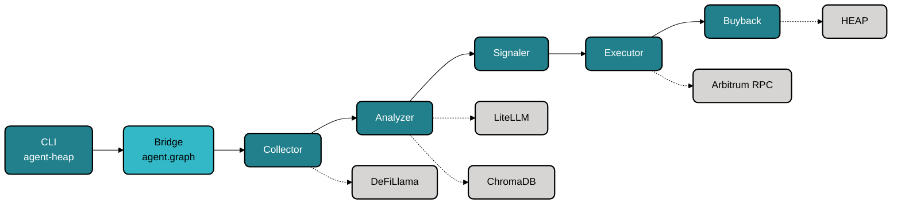

<p align="center">
  <picture>
    <source media="(prefers-color-scheme: dark)" srcset="https://img.shields.io/badge/Agent%20Heap-%F0%9F%97%BE%F0%9F%A4%96-7c3aed?style=for-the-badge&logo=github&logoColor=white">
    
  </picture>
</p>

<p align="center">
  <b>Autonomous AI agent for multi-chain yield optimization on Arbitrum.</b>
</p>

<p align="center">
  <a href="https://github.com/agentheap/agent-heap/actions"></a>
  <a href="https://github.com/agentheap/agent-heap"></a>
  <a href="https://github.com/agentheap/agent-heap"></a>
  <a href="https://github.com/agentheap/agent-heap"></a>
  <a href="https://github.com/agentheap/agent-heap"></a>
  <a href="https://github.com/agentheap/agent-heap"></a>
  <a href="https://github.com/agentheap/agent-heap"></a>
  <a href="https://github.com/agentheap/agent-heap/security"></a>
</p>

**Agent Heap** is a LangGraph-powered agent that monitors DeFi lending protocols (Aave V3, Compound III, Morpho Blue) on Arbitrum, analyzes yields via LLM reasoning, executes deposits using Kelly-criterion position sizing, and runs a HEAP token buyback loop.

- [Features](#features)
- [CLI](#cli)
- [Security](#security)
- [Architecture](#architecture)
- [Tests](#tests)
- [Quick Start](#quick-start)
- [Configuration](#configuration)
- [Roadmap](#roadmap)

---

## Features

| Layer | What it does |
|-------|-------------|
| **Yield monitoring** | Live APY + TVL from DeFiLlama for Aave V3, Compound III, Morpho Blue |
| **LLM analysis** | LiteLLM ranks pools by risk-adjusted yield -- supports OpenAI, Anthropic, Gemini, Groq, DeepSeek, 100+ models. Falls back to highest-APY heuristic. |
| **Position sizing** | Kelly-criterion computes optimal deposit size from available capital |
| **Execution** | Builds and sends real deposits on Arbitrum (testnet or mainnet). ERC-20 approve, EIP-1559 gas, 20% gas buffer, receipt confirmation. |
| **Circuit breaker** | Tracks daily PnL, halts on 5% drawdown |
| **Slippage protection** | Rejects trades exceeding configurable threshold |
| **HEAP buyback** | 10% of yield profits auto-buy-and-burn HEAP tokens |
| **Vector memory** | ChromaDB stores past decisions for context-aware ranking |
| **Static binary CLI** | CGO-free Go binary (~13MB), zero Python dependency at the command layer |

See [FEATURES.md](FEATURES.md) for the full breakdown.

---

## CLI

```text
Usage:
  agent-heap [command]

Available Commands:
  config      Manage environment configuration (.env)
  health      Check agent service health
  history     Show recent agent decisions
  memory      Show recent vector memory entries
  run         Run a single agent decision cycle
  security    Show security feature status
  start       Start the agent loop
  status      Show agent state and heartbeat
  wallet      Wallet management commands
```

### Quick reference

| Command | Description |
|---------|-------------|
| `agent-heap run` | Single-shot agent cycle, full result output |
| `agent-heap start --interval 21600` | Run the agent loop (6h interval) |
| `agent-heap status` | Agent state, uptime, wallet balance, DB size |
| `agent-heap health` | Ping RPC, ChromaDB, SQLite, LLM, wallet |
| `agent-heap history --limit 20` | Recent trades with gas costs and tx hashes |
| `agent-heap security` | Show which security features are enabled |
| `agent-heap config list` | Show all env vars (secrets masked) |
| `agent-heap config set KEY VALUE` | Update `.env` file |
| `agent-heap wallet balance` | Check ETH balance of configured wallet |
| `agent-heap wallet generate --encrypt --passphrase "..." --output wallet.json` | Create encrypted keystore |
| `agent-heap memory --last 10` | Query Chroma vector store |

---

## Security

Agent Heap has been hardened with three layers of transaction safety and encrypted key storage. See [SECURITY.md](SECURITY.md) for the full assessment.

| Control | Status | What it does |
|---------|--------|-------------|
| **Keystore encryption** | AES-256-GCM + scrypt | Encrypts private keys with a passphrase instead of plaintext env vars |
| **Address allowlist** | Network-aware | Only known protocol addresses (Aave, Compound, Morpho, USDC) are valid recipients -- rejects everything else |
| **Spending limits** | `MAX_TX_AMOUNT` + `DAILY_TX_LIMIT` | Caps per-transaction and daily volume |
| **Rate limiting** | `MAX_TX_PER_HOUR` | Prevents runaway loops from burning gas |
| **Circuit breaker** | 5% drawdown halt | Stops the agent when daily PnL exceeds threshold |
| **Slippage protection** | Configurable | Rejects trades with excessive price impact |

Run `agent-heap security` to see the current status of all controls.

### Keystore setup (recommended over plaintext PRIVATE_KEY)

```bash
# Generate an encrypted wallet
agent-heap wallet generate --encrypt --passphrase "your-passphrase" --output wallet.json

# Or encrypt an existing key
agent-heap wallet encrypt key.json --passphrase "your-passphrase" --output wallet.json

# Set env vars
echo "KEYSTORE_FILE=wallet.json" >> .env
echo "KEYSTORE_PASSPHRASE=your-passphrase" >> .env

# Verify
agent-heap security
```

The agent auto-detects keystore vs plaintext `PRIVATE_KEY` at runtime.

---

## Architecture



### Pipeline nodes

| Node | What it does |
|------|-------------|
| **Collector** | Fetches live APY + TVL from DeFiLlama for Aave V3, Compound III, and Morpho Blue on Arbitrum |
| **Analyzer** | LLM ranks pools by risk-adjusted yield using LiteLLM (any provider); falls back to highest-APY heuristic |
| **Signaler** | Kelly-criterion position sizing, circuit breaker check, and slippage estimation |
| **Executor** | Builds, simulates, signs, and sends deposit transactions via Web3.py |
| **Buyback** | 10% of yield profits automatically buy and burn HEAP tokens |

---

## Tests

| Language | Count | Status |
|----------|-------|--------|
| Go | 32 | Passing |
| Python | 28 | Passing |
| **Total** | **60** | **All passing** |

```bash
go test ./...          # Go tests
uv run pytest -v       # Python tests
```

---

## Quick start

```bash
# Clone
git clone https://github.com/agentheap/agent-heap.git
cd agent-heap

# Python deps
uv sync

# Build the CLI
make build

# Configure
cp .env.example .env
./agent-heap config set ARBITRUM_RPC https://sepolia-rollup.arbitrum.io/rpc
./agent-heap config set LLM_MODEL claude-sonnet-4-20250514
./agent-heap config set ANTHROPIC_API_KEY sk-...

# Generate an encrypted wallet
./agent-heap wallet generate --encrypt --passphrase "test" --output wallet.json
echo "KEYSTORE_FILE=wallet.json" >> .env
echo "KEYSTORE_PASSPHRASE=test" >> .env

# Verify setup
./agent-heap health
./agent-heap security

# Run one cycle
./agent-heap run

# Run continuously (6h interval)
./agent-heap start --interval 21600
```

---

## Configuration

All configuration is via `.env` file at the project root, managed through `agent-heap config` or direct editing.

| Variable | Required | Default | Description |
|----------|----------|---------|-------------|
| `ARBITRUM_RPC` | Yes | -- | Arbitrum RPC endpoint |
| `PRIVATE_KEY` | Conditional | -- | Wallet private key (use keystore instead) |
| `KEYSTORE_FILE` | Conditional | -- | Path to encrypted keystore |
| `KEYSTORE_PASSPHRASE` | Conditional | -- | Keystore decryption passphrase |
| `ARBITRUM_NETWORK` | No | `sepolia` | Set to `mainnet` for Arbitrum One |
| `LLM_MODEL` | No | -- | LiteLLM model name (e.g. `claude-sonnet-4-20250514`) |
| `ANTHROPIC_API_KEY` | Conditional | -- | API key for Anthropic models |
| `OPENAI_API_KEY` | Conditional | -- | API key for OpenAI models |
| `MAX_TX_AMOUNT` | No | -- | Max USDC per transaction |
| `DAILY_TX_LIMIT` | No | -- | Max USDC per day |
| `MAX_TX_PER_HOUR` | No | -- | Max transactions per hour |
| `MAX_SLIPPAGE` | No | `0.05` | Max slippage (5%) |

`PRIVATE_KEY` is only required if no keystore is configured. At least one LLM provider API key must be set if `LLM_MODEL` is configured; if neither is set, the agent runs in highest-APY fallback mode.

---

## Build from source

```bash
make build        # Static binary → ./agent-heap (CGO_ENABLED=0)
make test         # Run all Go tests
```

---

## Roadmap

- [x] LangGraph pipeline, DeFiLlama data feeds, Kelly sizing
- [x] HEAP token buyback loop
- [x] Go CLI with 9 commands, 60 tests
- [x] Security hardening (keystore, allowlist, spending & rate limits)
- [ ] **Mainnet** -- Funded wallet, live deposits on Arbitrum One
- [ ] **Auto-compound** -- Rebalance between pools
- [ ] **Notifications** -- Telegram/Discord alerts
- [ ] **Multi-chain** -- Base, Optimism, Polygon

---

## License

MIT

Built by AI agents (Claude Code) -- not a single line authored by a human.
